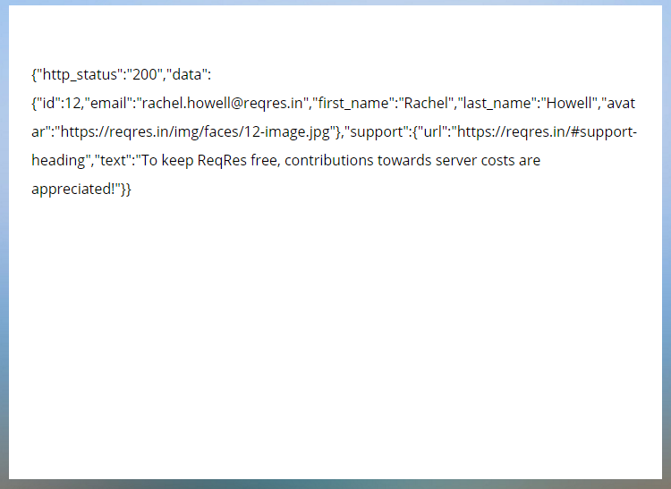
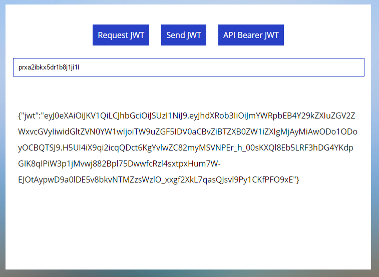
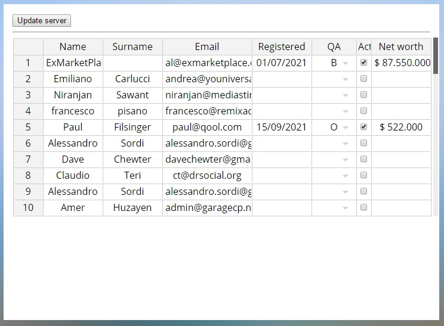

# NOTES

- Client / Server (Client need to be authorized to be to request API)
- URL : http://127.0.0.1:56729/
- Repo cloning, packages installation, compiling assets - check `bash/setup.sh`
- Compile assets : `npm run build`, `npm run build &> /dev/null` for no display, `npm run watch` for compiling in *watch* mode
- **Request JWT** - Request JWT from server / Sending `true` , Getting encoded JWT `eyJ0eXAiOiJ......`
- **Send JWT** - Request Authorization Bearer from server / Sending jwt sign (anonymous user object & public key), Getting API `Bearer` - jwt encode (authenticated user & private key)
- **API Bearer JWT** - Use client bearer token -> JWT server -> API server -> JWT server -> Client

# APP

- https://github.com/cztomczak/phpdesktop/wiki
- https://github.com/cztomczak/phpdesktop/wiki/Settings
- https://github.com/cztomczak/phpdesktop/wiki/Chrome-settings

# Configuration `settings.json`

- `web_server` > `listen_on` : port should be in between **49152–65535**
- `chrome` > `external_navigation` : **false** to open in OS default browser

# Resources

- **jwt-encode** - `npm i jwt-encode` - https://www.npmjs.com/package/jwt-encode
- **jwt-decode** - https://www.npmjs.com/package/jwt-decode
- Online RSA Key Generator - http://travistidwell.com/jsencrypt/demo/index.html
- **consola** - `npm i consola` - https://www.npmjs.com/package/consola
- - `consola.success('This is a success message');`
- - `consola.info('Give me some Info');`
- - `consola.error('I am not good because I am an error');`
- - `consola.silent('I am not going to be silent');`
- - `consola.fatal('I am fatal');`
- - `consola.warn('Warning consola ahead');`
- - `consola.log('logging out this message');`
- - `consola.ready('I am ready to log');`
- - `consola.start('lets start using consola');`

# Repo

- **master**

---

- **develop** [https://github.com/fadilxcoder/php-desktop-app/tree/develop]

---

- **jspreadsheet** [https://github.com/fadilxcoder/php-desktop-app/tree/jspreadsheet]

